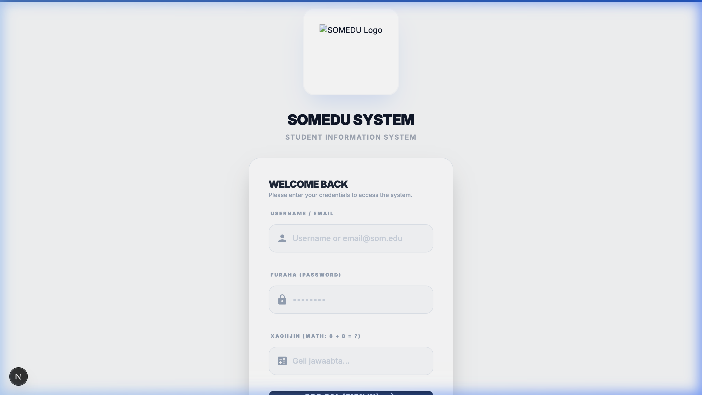

# SOMEDU — School Management System

> A modern multi‑tenant school management platform designed to digitize and streamline school operations.
>
> **Developed and Architected by Mohamed Jama**

---

## Overview

SOMEDU is a full‑stack SaaS web application built to replace manual, paper‑based school administration systems with a secure, scalable, and efficient digital solution.

The platform provides complete management tools for administrators, teachers, and students through isolated school portals and a centralized architecture.

> This project demonstrates my ability to design and build real‑world production systems, including database architecture, authentication, dashboards, and multi‑role platforms.

---

## 📸 Screenshots

| Login Page |
|---|
|  |

---

## Core Features

### 🏫 Administration Portal
- Student and teacher management
- Class and timetable configuration
- Exam and academic record management
- Announcement system
- Real‑time dashboard and reporting
- Smart student performance reports (rule-based, in Somali)

### 👩‍🏫 Teacher Portal
- Subject-based attendance management
- Grade submission and academic tracking
- Dynamic teaching schedule access
- Communication tools

### 🎒 Student Portal
- Personal timetable access (flexible, school-configured)
- Exam results and performance tracking
- Attendance records
- School announcements

---

## System Architecture

This system was designed with professional SaaS architecture principles:

- **Multi‑tenant architecture** — separate, isolated data per school
- **Secure authentication** — role‑based access with forced password change on first login
- **Scalable backend and database structure** — Supabase + PostgreSQL + RLS
- **Mobile‑responsive modern interface** — optimized for phones and tablets
- **Real‑world production‑ready system design**

---

## Technologies Used

| Technology | Purpose |
|---|---|
| **Next.js 15** | Full-stack React framework (App Router) |
| **TypeScript** | Type safety across the entire codebase |
| **Supabase** | Database, Authentication, Row-Level Security |
| **PostgreSQL** | Relational database with multi-tenant isolation |
| **Tailwind CSS** | Utility-first modern styling |

---

## 🚀 Getting Started

### 1. Clone the repository
```bash
git clone https://github.com/MOHAMEDJAMA1/SOMEDU.git
cd SOMEDU
```

### 2. Install dependencies
```bash
npm install
```

### 3. Set up environment variables
```bash
cp .env.example .env.local
# Fill in your Supabase URL and keys
```

### 4. Run the development server
```bash
npm run dev
```

Open [http://localhost:3000](http://localhost:3000) in your browser.

---

## Purpose of This Repository

This repository is intended for **portfolio and showcase purposes only.**

It demonstrates my skills in:
- Full‑stack system development
- SaaS architecture design
- Database design and management
- Multi‑role platform development
- Real‑world business system creation

---

## Author

**Mohamed Jama**
Full‑Stack Software Engineer | Founder of KODX

Specializing in building scalable web applications, SaaS platforms, and business automation systems.

---

## License

Copyright © 2026 Mohamed Jama. All rights reserved.

This source code is private and proprietary.
Unauthorized copying, modification, distribution, or use is strictly prohibited.
